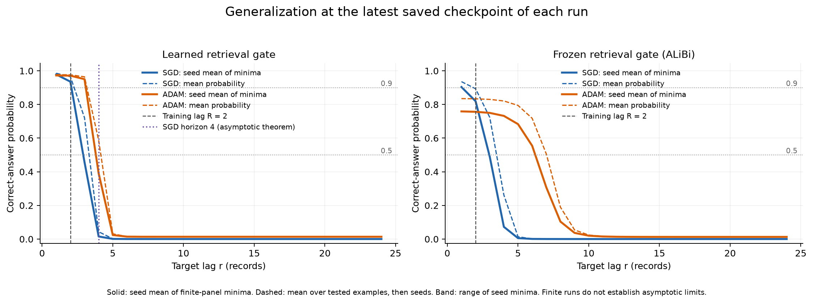
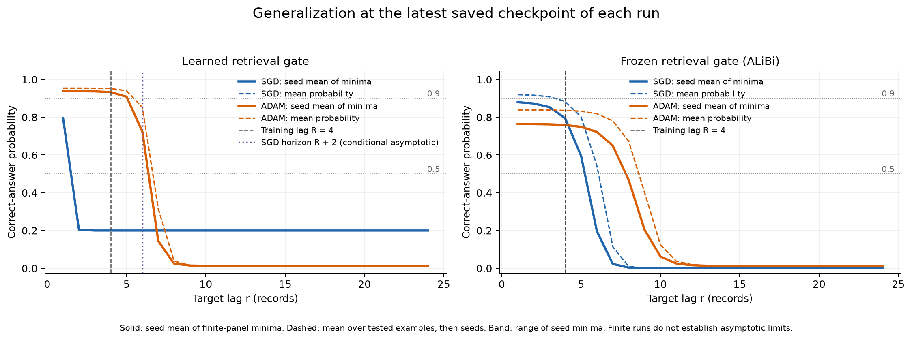

# Empirical pilot results

The implementation is complete, but these finite pilots do **not** yet reconfirm the full asymptotic generalization claims. All outcomes, including an unsuccessful training run, are retained.

Two independent suites used N=8 keys (56 ordered pairs), d=2,048, seed 0, 12,000 total updates per arm, h0=1, test lags 1–24, and stale-prefix lengths 0, 16, 64. The notebook defaults to three seeds for a fuller replication. Both suites use the same predetermined optimizer settings; no test-lag tuning was performed.

## What the pilots show

- At R=2, every arm fitted its training recall examples: minimum training-answer probability exceeded 0.985. Long stale-prefix evaluation is substantially harder. Frozen-retrieval Adam reached more distant lags, but its minimum confidence remained below 0.9 even at short lags.
- Learned-gate SGD at R=2 has not reached the theorem’s lag-4 limit: the observed minimum probability at lag 4 was about 0.015. This is not confirmation of that asymptotic boundary.
- At R=4, learned-gate SGD did not fit the training recall examples (minimum probability about 0.200, loss about 0.502). Its lag curve cannot be treated as evidence about post-convergence generalization. The notebook explicitly omits the additional R>2 basin preparation used by the sufficient theory. The other three arms fitted training recall above 0.986.
- Frozen-retrieval SGD and Adam both increased their measured content-distance horizon during these pilots. A finite increase is consistent with the new theory but does not establish an unbounded range or the asymptotic growth rate.

The probabilities below are the **minimum over all 56 ordered pairs and the three tested stale-prefix lengths**, after binary decoding. The newest record has lag 1. They are not averages over key pairs and are not minima over every possible input stream.

## Training recall lag R=2

| Gate | Optimizer | Training recall min P | Test P at r=2 | Test P at r=4 | Test P at r=5 |
|---|---|---:|---:|---:|---:|
| Learned | SGD | 0.9980 | 0.9357 | 0.0154 | 0.0011 |
| Learned | ADAM | 0.9854 | 0.9713 | 0.3909 | 0.0240 |
| Frozen retrieval | SGD | 0.9988 | 0.8196 | 0.0727 | 0.0055 |
| Frozen retrieval | ADAM | 0.9867 | 0.7565 | 0.7322 | 0.6833 |

[Full report](results/pilot_R2_seed0/report.md) · [Probability through training](results/pilot_R2_seed0/probability_by_training.png) · [Mechanism diagnostics](results/pilot_R2_seed0/theory_diagnostics.png)

## Training recall lag R=4

| Gate | Optimizer | Training recall min P | Test P at r=4 | Test P at r=6 | Test P at r=7 |
|---|---|---:|---:|---:|---:|
| Learned | SGD | 0.1999 | 0.1999 | 0.1999 | 0.1999 |
| Learned | ADAM | 0.9860 | 0.9329 | 0.7234 | 0.1444 |
| Frozen retrieval | SGD | 0.9975 | 0.7940 | 0.1952 | 0.0229 |
| Frozen retrieval | ADAM | 0.9876 | 0.7587 | 0.7222 | 0.6488 |

[Full report](results/pilot_R4_seed0/report.md) · [Probability through training](results/pilot_R4_seed0/probability_by_training.png) · [Mechanism diagnostics](results/pilot_R4_seed0/theory_diagnostics.png)

## Reproducibility and scope

Each suite saves its configuration, Gaussian initialization hashes, final model and Adam buffers, gradient-audit results, dataset, complete logged curves, and numerical status. Each model is trained from its own optimizer-specific acquisition applied to the same per-seed Gaussian initialization; there is no common pretrained matching table or optimizer-state reset.

The objective is the exact ordinary-answer loss on the serialized finite population. Analytical signed-log derivatives are checked against native autograd and a literal two-head forward pass, including R=2,3,4,7 and complemented labels. Adam steps are checked against PyTorch with fixed and annealed epsilon. All 12 tests and 72 subtests pass. Every notebook code cell also completed with smoke settings.

These runs use a tractable polynomial continuation schedule and growing SGD pair batches. They do not instantiate the theorem’s existential conservative SGD schedule, nor establish all finite-history or basin assumptions. The fully proved frozen-answer result uses R=2; R=4 is an empirical extension test. Longer runs, the additional preparation protocol for R>2, and multiple independent seeds are needed before making a stronger empirical confirmation claim.
