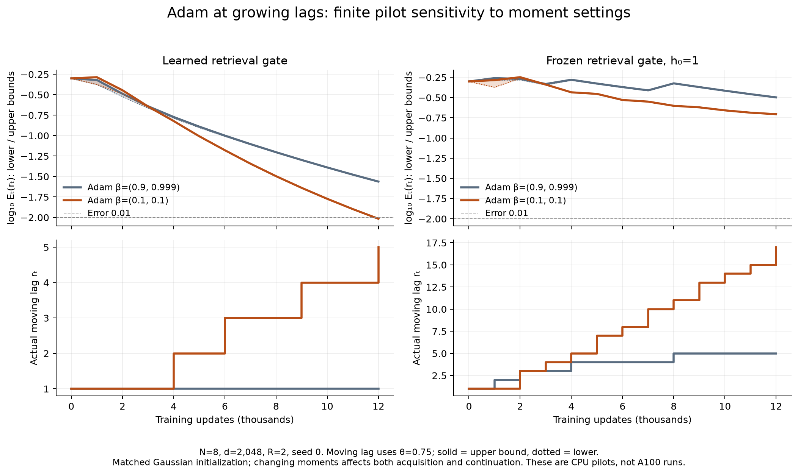

> Historical documentation for the earlier four-arm notebooks. Use ../README.md for the current eight-run library notebook.

# A100 experiment: error at growing recall lags

Use `FoX_Restricted_A100_Asymptotics.ipynb` for the larger experiment. It embeds
the implementation and tests. The default scale is **128 keys, 4,096 table
coordinates, 200,000 updates per arm, and three paired seeds**. This means
16,256 ordered key pairs and 65,280 weighted sequences including complements
and calibration. The restricted architecture is unchanged; this is not a
full-language-model benchmark.

The notebook checks the actual CUDA device, benchmarks it, and saves resumable
checkpoints. Select an A100 runtime in Colab. An A100 was not available in the
local development environment, so no local result is presented as an A100
measurement. GPU availability and runtime limits vary; see the official
[Colab FAQ](https://research.google.com/colaboratory/faq.html).

## The quantity being tested

We use the manuscript's answer-error definition

\[
\mathcal E_t(r)=\sup_{X:\,\operatorname{lag}(X)\le r}
\{1-P_{\theta_t}(y_\star\mid X)\},
\]

where the supremum covers all finite older prefixes and arbitrary binary
record values, with the latest queried-key record as the target. This is
different from Adam's denominator parameter `epsilon_t`.

The notebook does not equate an empirical test average with this supremum.
It computes an envelope

\[
\underline{\mathcal E}_t(r)\le\mathcal E_t(r)
\le\overline{\mathcal E}_t(r).
\]

The lower bound maximizes the infinite-stale-prefix witness over all ordered
key pairs. It is a limit of finite legal inputs. The upper bound uses the
manuscript's uniform attention-odds inequality

\[
A_t(r)=e^{4m_t\rho_t}
\frac{e^{-m_t\Delta_{\min,t}+(r-1)h_t}+e^{-h_t}}
{1-e^{-h_t}},\qquad
\overline{\mathcal E}_t(r)=
\sigma\!\left(-w_t\frac{1-A_t(r)}{1+A_t(r)}\right).
\]

The upper bound is recorded only when its row-norm, matching-gap, and sign
conditions hold. Failed conditions produce an unavailable certificate, not a
zero error. We evaluate errors directly from logits and retain their natural
logarithms, avoiding cancellation in `1 - sigmoid(logit)`.

## Fixed and moving lags

The output includes fixed-lag error trajectories, the `R+2`/`R+3` SGD boundary
probes, and three families of moving lags:

- Current-gap radius: a fixed fraction of `m * delta_min / h`, with the
  learned/frozen offsets from the theory.
- Acquired-gap radius: the same construction using the gap recorded after
  acquisition. Whether that gap is retained is measured, not assumed.
- Exogenous clocks: predeclared `floor(1 + c*S)` for learned retrieval and
  `floor(1 + c*S**2)` for frozen retrieval, where `S` is the cumulative scalar
  learning rate. Coefficients are not fitted to observed test error.

Every error plot has a corresponding `r_t` trajectory. Moving lags have no
fixed evaluation cap and do not require allocating a sequence of length
`r_t`. A clamped or flat radius is not evidence for `r_t -> infinity`.
The theorem does **not** promise vanishing error for every diverging choice of
`r_t`: the lag must remain within the content-versus-distance scale, with
sufficient margin, vanishing amplified leakage, and a growing decoder.
In particular, the polynomial clock probes for SGD are stress tests, not a
claimed SGD growth law.

`certified_radii.csv` also records the largest integer radius that the uniform
upper bound certifies at errors 0.1, 0.01 and 0.001. This is a certified lower
bound on the true successful radius, not the exact generalization boundary.

## Why the earlier Adam plot was not an asymptotic failure

The original `N=8, R=2`, 12,000-step Adam run ended at `S=53.93`. For learned
retrieval, `m*delta_min/h` was only 2.98; the conservative theorem radius
`floor(m*delta_min/h - 1)` was therefore only 1. Failure at lag 4 or beyond is
not a contradiction of a growing-range limit.

The learned binder's normalized Adam update magnitude was about 0.0028 at that
checkpoint, far from its asymptotic unit direction. Its factor ratio `u/S`
was about 0.069, versus the theorem's eventual multiplier 1.5. The annealed
epsilon was already negligible. Increasing the model size alone does not
establish moment tracking; the new logs expose the gradients, moments and
factor-speed ratios directly.

For frozen `h0=1`, the infinite-prefix attention floor gives the unavoidable
lag-one answer error

\[
\mathcal E_t(1)\ge\sigma[-w_t(1-2/e)].
\]

At the old decoder weight `w=4.339`, this is approximately 0.241. Even unlimited
content gain cannot remove that finite-decoder confidence limit. Error below
0.01 in this witness requires `w` at least about 17.39. The limit can still
vanish as the decoder grows.

A separate measured 12,000-step CPU pilot with the repository's `(0.1,0.1)`
moments already shows a clearer finite trend. For the current-gap moving lag
with `theta=0.75`, learned retrieval reached `r_t=5` with numerical lower/upper
error bounds both approximately **0.00963**. Frozen retrieval reached `r_t=17`
with bounds both approximately **0.1971**, still limited by its finite decoder.
These are single-seed sensitivity results, not an A100 run or an asymptotic
proof. Both matching acquisition and continuation change with the moment
settings.

The underlying [short-memory error report](../results/adam_moment_sensitivity_R2_seed0/asymptotic_reanalysis/asymptotic_report.md)
and [original-moment error report](../results/pilot_R2_seed0/asymptotic_reanalysis/asymptotic_report.md)
retain all schedules, including those that outpace recall and fail. Reproduce
the analysis with `reanalyze_errors.py`, and the comparison figure with
`plot_adam_sensitivity.py`.

## Optimizer settings and interpretation

The A100 notebook exposes the repository's short-memory Adam setting
`beta1=beta2=0.1` and the earlier `0.9,0.999` setting under distinct run tags.
Both satisfy `beta1**2 < beta2`; neither is sign descent. The short-memory
choice addresses a measured finite-time moment-tracking transient. It also
affects matching acquisition, so the sensitivity comparison is not an
intervention on continuation moments alone. All runs start from independent
Gaussian Q/K tables paired by seed, with zero initial Adam buffers. Buffers
are retained through acquisition, continuation and resumption.

FP64 parameters and signed-log gradients/moments remain necessary here; BF16
would change the numerical experiment. Optional `torch.compile` is a runtime
optimization with a parity check, not a change to the objective. See the
[PyTorch compiler documentation](https://docs.pytorch.org/docs/stable/generated/torch.compile.html).

Keep the same run tag and scientific configuration to resume after a Colab
disconnect. Extend the step budget to continue a checkpoint. Changing the
optimizer moments, rates, vocabulary, training lag or evaluation definitions
requires a new run tag. The runner preserves the RNG and complete optimizer
history; it does not restart acquisition or replace an existing experiment.

These remain finite experiments with practical continuation schedules. The
SGD existence schedule is much more conservative, and the `R>2` sufficient
SGD result needs extra basin preparation. The frozen-answer convergence proof
uses `R=2`. Use the default `R=2` for the primary asymptotic diagnostic, and
label larger `R` as an extension test. Vanishing upper bounds together with
growing radii are the desired empirical pattern; neither a single final
probability curve nor a fitted slope proves an infinite-time theorem.
